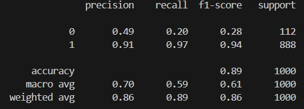
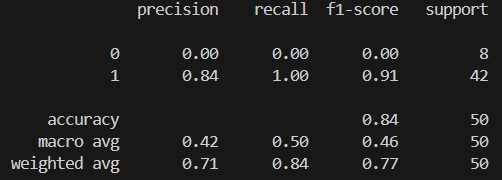

# Sentiment Analysis using Machine Learning vs VADER

This repository contains a comparative study between a Machine Learning (ML) model and VADER (Valence Aware Dictionary and sEntiment Reasoner) for sentiment analysis on a dataset of Amazon reviews.

## Project Overview

The goal of this project is to build a sentiment analysis model using a machine learning approach and compare its performance with the VADER sentiment analysis tool. The dataset used in this project contains Amazon product reviews, with each review labeled as positive (1) or negative (0).

## Dataset

- **Source**: [Amazon Reviews](https://raw.githubusercontent.com/pycaret/pycaret/master/datasets/amazon.csv)
- **Size**: 20,000 reviews (limited to 1,000 for comparison purposes)
- **Columns**: `reviewText` (the review text), `Positive` (the sentiment label)

## Model Comparison

### 1. Machine Learning Model

- **Algorithm**: Logistic Regression
- **Text Processing**: 
  - Tokenization
  - Stopwords removal
  - Lemmatization
  - TF-IDF Vectorization
- **Evaluation Metrics**: 
  - Precision
  - Recall
  - F1 Score
  - Accuracy

### 2. VADER Sentiment Analysis

- **Approach**: Rule-based model specifically tuned for sentiments expressed in social media.
- **Evaluation Metrics**:
  - Precision
  - Recall
  - F1 Score
  - Accuracy

### Results

- **VADER**:
  - Higher Precision
  - Higher F1 Score
  - Higher Accuracy

  

- **ML Model**:
  - Perfect Recall (identified all actual positives)
  - Lower Precision and F1 Score compared to VADER

  

The ML model achieved perfect recall, meaning it captured all positive instances, but at the cost of generating more false positives. VADER, on the other hand, balanced precision and recall more effectively, leading to a higher F1 score and overall accuracy.

## How to Run the Code

1. Clone the repository:
    ```bash
    git clone https://github.com/Arch7399/sentiment-analyzer.git
    ```

2. Run the sentiment analysis code:
    ```bash
    python sentiment-analysis.py
    python sentiment-model.py
    ```

3. Evaluate the performance:
    - View the classification report generated by the code to compare the ML model and VADER.

## Dependencies

- pandas
- nltk
- scikit-learn
- vaderSentiment
